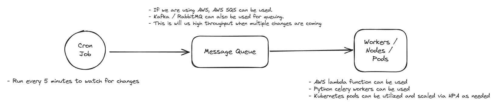

# GenAI Labs - Back-End Candidate Challenge

## Features

*   **Ingestion:** Upload journal articles in JSON format.
*   **Search:** Perform similarity searches to find relevant articles.
*   **Chat:** A chat with a generative AI to get answers based on the provided articles.
*   **Usage Tracking:** Tracks how many times each article is used to provide context for the chat.

## API Endpoints

*   `PUT /api/upload`: Uploads a list of journal chunks.
*   `POST /api/similarity_search`: Performs a similarity search on the uploaded chunks.
*   `POST /api/chat`: Engages in a chat with the generative AI.
*   `GET /api/usage_statistics`: Retrieves usage statistics for the documents.
*   `GET /api/{journal_id}`: Retrieves all chunks for a specific journal.

## Ingestion Pipeline Design

This section outlines the design for a robust and scalable ingestion pipeline, as requested by the challenge.

### Architectural Overview




A scalable approach I think would be to decouple the file detection from the processing using a message queue. This allows for resilience and independent scaling of components.

1.  **File Trigger**: A service (e.g., a simple cron job) detects new journal files in the designated secure location.
2.  **Message Queue**: Upon detecting a new file, the trigger service places a message onto a queue (e.g., RabbitMQ, Kafka). 
3.  **Processing Workers**: A pool of worker processes (e.g., using Celery with Python, AWS Lambda functions, or Kubernetes Pods) listens to the queue. When a message is received, a worker executes the ingestion logic. We can include logging and monitoring capability, which can help with debugging if anything fails in future. 

This design ensures that even if a worker fails during processing, the message can be retained in the queue and retried, preventing data loss. It also allows us to scale the number of workers/nodes/pods based on the volume of incoming files.

### Pseudocode for a Processing Worker

```python
def process_journal_file(file_path):
    """
    Worker function to process a single journal file.
    """
    try:
        log(f"Starting ingestion for {file_path}")

        # 1. Download and Validate File
        # Use a robust HTTP client with retries.
        # Validate file type, size, etc.
        raw_content = download_file_from_storage(file_path)
        if not is_valid_journal(raw_content):
            raise ValueError("Invalid file format or content.")

        # 2. Parse and Chunk Content
        # Use a library appropriate for the journal format (e.g., PyMuPDF for PDFs).
        # Chunking strategy: Prioritize semantic coherence.
        # - We can first try splitting by document sections (e.g., "Abstract", "Introduction").
        # - If sections are too large, we can split by paragraphs.
        # - As fallback, we can use a recursive character splitter with overlap to maintain context. Overlap can be a key hyperparam here
        document_text = parse_journal(raw_content)
        chunks = chunk_text_semantically(document_text)
        log(f"Successfully chunked {file_path} into {len(chunks)} segments.")

        # 3. Generate Embeddings and Attach Metadata
        # Batch process chunks to optimize calls to the embedding model.
        chunk_texts = [chunk.text for chunk in chunks]
        embeddings = embedding_model.encode(chunk_texts, batch_size=32)
        log(f"Generated {len(embeddings)} embeddings.")

        documents_to_upsert = []
        for i, chunk in enumerate(chunks):
            metadata = {
                "id": f"{file_path}_{i}",
                "source_doc_id": file_path,
                "section_heading": chunk.metadata.get("section_heading", "N/A"),
                "journal": "TBD_JOURNAL", # Extract from document if possible
                "publish_year": 2023, # Extract from document if possible
                "usage_count": 0,
                "attributes": ",".join(chunk.metadata.get("attributes", [])),
                # ... other metadata
            }
            documents_to_upsert.append({
                "id": metadata["id"],
                "embedding": embeddings[i],
                "metadata": metadata,
                "document": chunk.text
            })

        # 4. Write to Vector Database
        # Use 'upsert' to handle both new and updated documents.
        # Perform this as a single batch operation for efficiency.
        vector_db.collection("journal_chunks").upsert(documents=documents_to_upsert)
        log(f"Successfully upserted {len(documents_to_upsert)} chunks to Vector DB.")

        # 5. Post-processing: Move the processed file to an archive location
        move_file_to_archive(file_path)

    except Exception as e:
        log_error(f"Failed to process {file_path}: {e}")
        # Move the file to a 'failed' or 'dead-letter' directory for manual inspection.
        move_file_to_failed_directory(file_path)

```

## Vector Database Selection: ChromaDB

For this project, I chose ChromaDB as the vector database. We can go with other production alternatives as well like Weaviate or Pinecone. These would provide us better scalability and infra for production grade application. For local development and showcasing my skill of using vectorDB i went with ChromaDB. 

## Setup and Installation

1.  **Clone the repository:**

    ```bash
    git clone <repository-url>
    ```

2.  **Create a virtual environment:**

    ```bash
    python -m venv venv
    ```

3.  **Activate the virtual environment:**

    *   **Windows:**

        ```bash
        .\venv\Scripts\activate
        ```

    *   **macOS/Linux:**

        ```bash
        source venv/bin/activate
        ```

4.  **Install the dependencies:**

    ```bash
    pip install -r requirements.txt
    ```

5.  **Create a `.env` file** in the root of the project and add your `GOOGLE_API_KEY`:

    ```
    GOOGLE_API_KEY=your-google-api-key
    ```

6.  **Run the application:**

    ```bash
    uvicorn app.main:app --reload
    ```

7.  **Run the Streamlit UI (optional):**

    ```bash
    streamlit run app/ui.py
    ```
